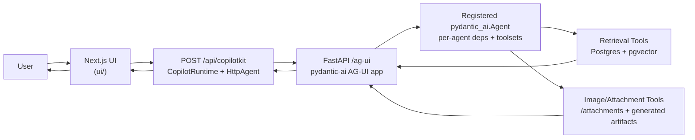

# ikea_agent

Typed IKEA assistant runtime and UI integration project built around:

- `pydantic-ai` agents + typed toolsets for chat orchestration and tool execution
- FastAPI runtime exposing both web chat and AG-UI endpoints
- Postgres + `pgvector` for retrieval and catalog metadata
- Next.js + TypeScript UI workspace for CopilotKit/AG-UI integration

## What this repo does

- Runs a chat-first IKEA assistant that can retrieve products, render tool activity, and stream responses.
- Exposes per-agent AG-UI backend routes for CopilotKit-style frontends.
- Supports image attachments plus fal.ai-backed image analysis tools (object detection, depth estimation, segmentation).
- Provides a deterministic mock UI mode for fast frontend iteration and E2E testing.

## Repository structure

- `src/ikea_agent/chat/` — agent builders, tool wiring, and runtime helpers
- `src/ikea_agent/chat_app/` — FastAPI app (`/`, `/ag-ui`, `/attachments`, generated image routes)
- `src/ikea_agent/retrieval/` — retrieval/rerank/data-access stack
- `src/ikea_agent/shared/` — typed contracts + shared infra helpers
- `ui/` — Next.js TypeScript frontend workspace (unit + E2E tests)
- `tests/` — pytest backend tests
- `spec/` — implementation specs and milestone plans
- `external_docs/` — collected notes for external libraries/protocols
- `legacy/` — reference-only historical content

## Prerequisites

- Python `3.13`
- `uv` for Python dependency management
- Node `20` + `pnpm` (via `corepack`) for the UI workspace
- Docker for the slot-local Postgres dependency
- Recommended: authenticated `gh` CLI so bootstrap can fetch the latest published Postgres snapshot when the local cache is empty
- Optional: `GEMINI_API_KEY`/`GOOGLE_API_KEY` plus `ALLOW_MODEL_REQUESTS=1` for real model-backed agent runs

## Run locally

### Quick review in one checkout

1. Start the human-owned local runtime:
   `make dev human`
2. Open the UI:
   `http://127.0.0.1:3190/agents/search`

`make dev human` is the human-only convenience entrypoint for the canonical
checkout. It reserves slot `90`, writes `.tmp_untracked/worktree.env`, starts or
reuses a persistent Docker Postgres on port `15522`, and then launches backend +
real UI on ports `8190` and `3190`.

`make reset` stops the backend/UI processes for the current slot and clears the
Next cache, but it does not remove the human Postgres volume.

Agents must not use `make dev human`. Agents should continue to use
`make agent-start ...` in a dedicated worktree.

### Manual bootstrapped startup

`make dev-all` still exists. It was not replaced, but it assumes the slot-local
environment file at `.tmp_untracked/worktree.env` already exists. After a manual
bootstrap, these are equivalent ways to start the real app:

- `scripts/worktree/run-dev.sh`
- `make dev-all`

Manual bootstrap:

- `bash scripts/worktree/bootstrap.sh --slot 7`

Bootstrap:

- starts the slot-local Docker Postgres on `15432 + slot`
- writes `.tmp_untracked/worktree.env` with backend/UI/database ports
- runs `uv sync --all-groups`
- installs UI deps

### Start pieces separately

After bootstrap:

- Optional environment check: `make preflight`
- Backend only: `make chat`
- Real UI against the slot-local backend: `make ui-dev-real`
- Mock UI only: `make ui-dev-mock`
- Mock all-in-one startup: `make dev-all-mock`
- Reset local UI/backend dev processes and Next cache: `make reset`

Real UI mode reads the slot-local backend target from `.tmp_untracked/worktree.env`,
for example `http://127.0.0.1:8107/ag-ui/`.

### Agentic worktree flow

For mutating work, start from a dedicated worktree:

1. Create and bootstrap the worktree:
   `make agent-start SLOT=7 ISSUE=<bead-id>`
   or
   `make agent-start SLOT=7 QUERY="<text>"`
2. `cd` into the printed worktree path
3. Start the app with either `scripts/worktree/run-dev.sh` or `make dev-all`

Do not use `make dev human` from an agent worktree. It is reserved for the
human-owned canonical checkout and stable slot `90`.

## Architecture (request flow)

Local bootstrap restores a versioned Postgres snapshot into the slot-local
Docker volume during normal setup. Bootstrap first checks the worktree-local
snapshot cache and, when that cache is empty, attempts to fetch the latest
published snapshot artifact from the repo's `Postgres Snapshot` workflow. The
slow rebuild-from-source path remains an explicit maintenance flow via
`scripts/worktree/deps.sh reseed --slot <n>`.

## Testing and quality

- Common run targets:
  - `make dev human`
  - `make chat`
  - `make ui-install`
  - `make ui-dev-real`
  - `make ui-dev-mock`
  - `make dev-all`
  - `make reset`
- Backend tests: `make test`
- UI lint: `make ui-lint`
- UI typecheck: `make ui-typecheck`
- UI unit tests: `make ui-test`
- UI mock E2E: `make ui-test-e2e`
- UI real-backend smoke E2E: `make ui-test-e2e-real`
- Lint/format/typecheck pipeline: `make format-all`
- Pre-commit quality gate: `make tidy` (backend Ruff/Pyrefly/Pytest plus frontend ESLint/TypeScript/Vitest; real-backend smoke stays separate)

## Multi-Agent Shortcuts

- Start mutating task work in an isolated worktree:
  - `make agent-start SLOT=<0-99> ISSUE=<bead-id>`
  - `make agent-start SLOT=<0-99> QUERY="<text>"`
- Start backend + real UI in a bootstrapped checkout: `scripts/worktree/run-dev.sh`
- Human-only canonical-checkout startup: `make dev human`
- List explicit merge queue items for merge runs:
  - `make merge-list`

## Image analysis setup

- Add `FAI_AI_API_KEY=...` to `.env` (or `FAL_KEY=...`).
- Start backend (`make chat`) and UI (`make ui-dev-real`).
- Upload a room photo in chat and call one of:
  - `analyze_room_photo`
  - `detect_objects_in_image`
  - `estimate_depth_map`
  - `segment_image_with_prompt`

See [docs/tools/image_analysis.md](docs/tools/image_analysis.md) for tool contracts and runtime behavior.
