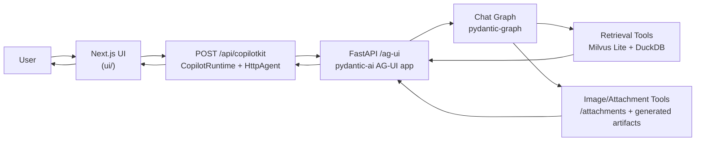

# ikea_agent

Typed IKEA assistant runtime and UI integration project built around:

- `pydantic-ai` + `pydantic-graph` for chat orchestration and tool execution
- FastAPI runtime exposing both web chat and AG-UI endpoints
- Milvus Lite + DuckDB for retrieval
- Next.js + TypeScript UI workspace for CopilotKit/AG-UI integration

## What this repo does

- Runs a chat-first IKEA assistant that can retrieve products, render tool activity, and stream responses.
- Exposes AG-UI-compatible backend routes for CopilotKit-style frontends.
- Supports image attachments plus fal.ai-backed image analysis tools (object detection, depth estimation, segmentation).
- Provides a deterministic mock UI mode for fast frontend iteration and E2E testing.

## Repository structure

- `src/ikea_agent/chat/` — agent + graph logic
- `src/ikea_agent/chat_app/` — FastAPI app (`/`, `/ag-ui`, `/attachments`, generated image routes)
- `src/ikea_agent/retrieval/` — retrieval/rerank/data-access stack
- `src/ikea_agent/shared/` — typed contracts + shared infra helpers
- `ui/` — Next.js TypeScript frontend workspace (unit + E2E tests)
- `tests/` — pytest backend tests
- `spec/` — implementation specs and milestone plans
- `external_docs/` — collected notes for external libraries/protocols
- `legacy/` — reference-only historical content

## Prerequisites

- Python `3.13`
- `uv` for Python dependency management
- Node `20` + `pnpm` (via `corepack`) for the UI workspace
- Optional: `GEMINI_API_KEY`/`GOOGLE_API_KEY` for real model-backed agent runs

## Run locally

### Backend

1. Install Python deps: `make deps`
2. Optional environment check: `make preflight`
3. Start backend: `make chat`
4. Open web UI: `http://127.0.0.1:8000`

### Frontend (separate process)

1. Install UI deps: `make ui-install`
2. Start mock UI: `make ui-dev-mock`
3. Start UI against real backend: `make ui-dev-real`

By default, real UI mode targets `http://127.0.0.1:8000/ag-ui/` via `PY_AG_UI_URL`.

### Start everything

- Real backend + UI together: `make dev-all`
- Mock UI only: `make dev-all-mock`
- Reset local UI/backend dev processes and Next cache: `make reset`

## Architecture (request flow)

## Testing and quality

- Common run targets:
  - `make chat`
  - `make ui-install`
  - `make ui-dev-real`
  - `make ui-dev-mock`
  - `make dev-all`
  - `make reset`
- Backend tests: `make test`
- UI unit tests: `make ui-test`
- UI mock E2E: `make ui-test-e2e`
- UI real-backend smoke E2E: `make ui-test-e2e-real`
- Lint/format/typecheck pipeline: `make format-all`
- Pre-commit quality gate: `make tidy`

## Multi-Agent Shortcuts

- Start mutating task work in an isolated worktree:
  - `make agent-start SLOT=<0-99> ISSUE=<bead-id>`
  - `make agent-start SLOT=<0-99> QUERY="<text>"`
- List explicit merge queue items for merge runs:
  - `make merge-list`

## Image analysis setup

- Add `FAI_AI_API_KEY=...` to `.env` (or `FAL_KEY=...`).
- Start backend (`make chat`) and UI (`make ui-dev-real`).
- Upload a room photo in chat and call one of:
  - `analyze_room_photo`
  - `detect_objects_in_image`
  - `estimate_depth_map`
  - `segment_image_with_prompt`

See [docs/tools/image_analysis.md](docs/tools/image_analysis.md) for tool contracts and runtime behavior.
