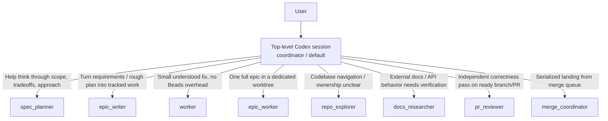
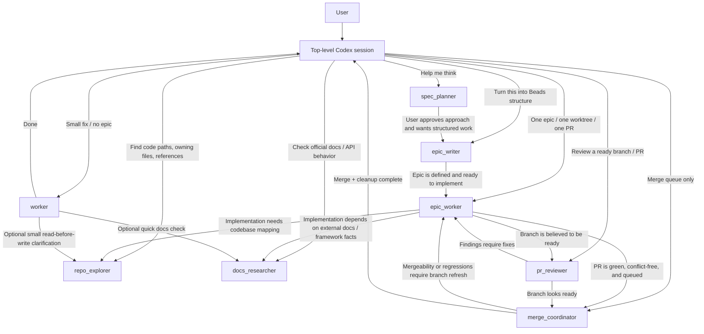

Dropped the stash.

**What Worked**
- Splitting the work by epic was the right call: trace intake and search/bundles were mostly separable.
- Dedicated worktrees helped a lot once we actually used them consistently.
- Beads gave us durable tracking for epics, child tasks, merge queue items, and post-merge closure.
- Forcing every branch through `make tidy` and the real UI smoke caught real issues before merge.

**Main Friction**
- Subagent reliability was mixed:
  - one subagent dropped immediately
  - others gave partial or stale handoffs
  - I still had to inspect branches directly rather than trusting agent summaries
- We blurred “planning”, “implementation”, and “merge-run” phases at first.
- We had a few environment mismatches:
  - git identity script expected old values
  - Playwright smoke timing was too optimistic
  - DuckDB lock issues showed up during backend smoke startup
- Main checkout hygiene caused pain:
  - local unstaged work on `main` blocked fast-forward during merge
  - the stale stash was a symptom of that
- Worktree cleanup happened late rather than as part of the normal merge closeout.

**What To Do Better Next Time**
- Start with a stricter contract for each subagent:
  - exact worktree
  - exact Beads IDs
  - exact files owned
  - exact validation commands
  - exact deliverables: commit SHA, PR URL, blockers only
- Treat subagent output as a handoff, not truth:
  - always review `git diff --stat`, key files, and validation output yourself before merge
- Keep one branch per epic, but make merge readiness explicit:
  - “implementation done”
  - “validated”
  - “pushed + PR open”
  - “queued for merge”
- Reserve `main` for merge handling only.
- Clean merged worktrees immediately after merge.
- Capture environment exceptions as repo tasks early:
  - stale git identity checker
  - smoke timeout assumptions
  - backend lock/startup quirks

**Suggested Protocol**
- Step 1: create/populate epic + child tasks in Beads.
- Step 2: create one worktree per epic.
- Step 3: assign one subagent per epic with explicit ownership.
- Step 4: require each subagent to return only:
  - branch
  - commit
  - PR
  - validations run
  - blockers
- Step 5: reviewer agent verifies diffs and reruns gates.
- Step 6: create merge-queue beads, merge one PR at a time.
- Step 7: close epic/tasks, remove merged worktrees, confirm queue empty.

**Biggest Lesson**
- Subagents are best used as parallel implementers, but not as autonomous closers. The highest-leverage pattern is:
  - subagents write and validate,
  - one coordinator reviews, merges, closes Beads, and cleans worktrees.

If you want, next I can turn this into a short reusable runbook in `docs/` for “epic + subagent + merge queue workflow.”

# Feedback on Agents.md
Yes — a lot of my suggestions are already in `AGENTS.md`; the main problems were gaps in enforcement, a couple of ambiguities, and one direct contradiction with reality.

**Already Covered Well**
- **Use dedicated worktrees for mutating work** is already explicit in `AGENTS.md:35` and reinforced by the “one worktree per epic” rule in `AGENTS.md:44`.
- **Separate merge handling from normal implementation** is already covered in `AGENTS.md:38` and again in the Beads merge exception at `AGENTS.md:197`.
- **Use merge queue items with blocked + merger-agent shape** is already specified in `AGENTS.md:46` and `AGENTS.md:199`.
- **Run strong validation before saying work is ready** is already there via `make tidy` in `AGENTS.md:53` and the behavior smoke gate in `AGENTS.md:58`.
- **Keep tool contracts typed and coordinated across backend/UI** is already strong in `AGENTS.md:74`, `AGENTS.md:87`, `AGENTS.md:97`, and `AGENTS.md:104`.
- **Use Beads as the single tracker with context/DoD/references** is already clearly stated in `AGENTS.md:185` and `AGENTS.md:192`.

**What Caused Real Errors**
- **Git identity instructions conflict with the checker**:
  - `AGENTS.md` says use `Talolard / talolard@users.noreply.github.com` at `AGENTS.md:174`
  - but `./scripts/check_git_identity.sh` still expects the old identity, so following AGENTS causes the checker to fail.
  - This was a direct operational error source.
- **Merge queue type rule is ahead of the installed `bd` reality**:
  - `AGENTS.md:46` says `issue_type=merge-request`
  - `AGENTS.md:200` partially acknowledges compatibility fallback
  - in practice, `bd create --type merge-request` failed, so we had to use `task + label=merge-request`.
  - The doc is close, but the earlier policy wording reads stronger than the tool actually supports.
- **Behavior gate is correct, but the environment assumptions are incomplete**:
  - `AGENTS.md:58` requires `make ui-test-e2e-real-ui-smoke`
  - but there’s no note that real-backend smoke may hit slow streaming or DuckDB lock contention.
  - So the rule is good, but missing operational caveats caused friction.

**What’s Missing From `AGENTS.md`**
- **Immediate post-merge worktree cleanup** is not stated.
  - It says to use worktrees, but not to remove merged ones promptly.
  - That should probably live near `AGENTS.md:42`.
- **Coordinator vs subagent responsibility split** is not defined.
  - Right now the file tells us how to structure work, but not that subagents should implement while a coordinator reviews, merges, and closes queue items.
- **Required subagent handoff format** is missing.
  - Something like: branch, commit, PR, validations run, blockers only.
  - That would reduce fuzzy or stale handoffs.
- **Main checkout hygiene during merge runs** is not explicit.
  - `AGENTS.md:44` implies it, but it doesn’t say “keep `main` clean; don’t leave partial implementation edits there.”
  - That would have prevented the stash/fast-forward friction.

**Where `AGENTS.md` Drove Good Behavior**
- The plan/doc split in `AGENTS.md:26` helped.
- The merge-runbook pointer in `AGENTS.md:40` was useful.
- The compatibility clause for merge labels in `AGENTS.md:201` saved us once `bd` rejected `merge-request`.

**What I’d Change In `AGENTS.md`**
- Add under Worktree policy:
  - “Remove merged worktrees immediately after merge verification.”
- Add under Merge Queue policy:
  - “If `bd` cannot create `merge-request`, always use `task + label=merge-request`.”
- Add under Workflow:
  - “Coordinator owns final review, merge, Beads closure, and cleanup.”
  - “Subagent handoff must include: worktree, branch, commit, PR, validations, blockers.”
- Add under Git Identity:
  - either fix `scripts/check_git_identity.sh`, or note that the script may lag and AGENTS is source of truth.

**Net**
- `AGENTS.md` mostly points in the right direction.
- The biggest actual defects were:
  - stale git identity checker vs `AGENTS.md:174`
  - merge-request type mismatch vs real `bd`
  - no explicit merged-worktree cleanup rule
  - no explicit coordinator/subagent handoff contract

If you want, I can draft the exact `AGENTS.md` patch for those improvements next.

# New suggestion: epic-owned merge gating

Tal's suggestion:
- Each epic should be blocked by the PR-merge task that eventually goes into the merge queue.
- That merge task should itself be blocked by:
  - all implementation tasks in the epic
  - a Beads gateway that requires all GitHub checks to pass
- The agent owning the epic should be responsible for checking PR status periodically (for example every 30 seconds), fixing red builds, and rebasing/resolving `main` conflicts before checks pass.

My feedback:
- This is a strong model because it makes merge-readiness part of the epic definition of done, not a separate afterthought.
- It would reduce the handoff gap we hit between “implementation is done” and “merge run is actually safe”.
- It also fits the repo well because Beads already models blocked work and the merge queue already exists.

What I would refine:
- Keep the **epic owner agent** responsible for getting the branch to a merge-ready state:
  - implementation complete
  - PR open
  - GitHub checks green
  - branch rebased / conflicts with `main` resolved
- Then hand off to a **merge coordinator** for the final one-at-a-time merge from the queue.
- In other words: the epic agent owns readiness; the merge agent owns serialization and final landing.

Why split it that way:
- If the epic agent also owns the final merge, it is easier to accidentally lose queue discipline or merge two things concurrently.
- If the merge coordinator owns all final merges, we keep one place that:
  - confirms latest `main`
  - handles final queue ordering
  - closes merge-request beads
  - removes merged worktrees immediately

Recommended Beads shape:
- Epic
  - implementation tasks
  - `gateway: github-checks-green`
  - `merge-request task`
- Dependencies:
  - `merge-request task` depends on every implementation task
  - `merge-request task` depends on `gateway: github-checks-green`
  - epic stays open until the merge-request task is closed by successful merge

Operational notes:
- Polling every 30 seconds is reasonable for an active merge-readiness loop, but it should stop once the PR is green or explicitly blocked.
- The epic owner should append concise notes when checks fail: failing check name, likely cause, and whether a fix was pushed.
- If `main` moves and causes conflicts, the epic owner should resolve and rerun required validation before returning the PR to “ready”.
- The merge coordinator should assume the branch is supposed to be ready, but still verify mergeability and rerun any required local merge-time validation.

Small update to the earlier AGENTS.md feedback:
- The git identity issue is now conceptually resolved because Tal updated `AGENTS.md` to use `Tal Perry` as the correct identity.
- The remaining action is to keep `./scripts/check_git_identity.sh` aligned with that source of truth so the workflow does not drift again.

# Codex multi-agent roles to formalize

OpenAI's Codex multi-agent docs suggest that roles work best when they are **narrow and opinionated**, with one clear job, a tool surface that matches that job, and role-specific config layered through `.codex/config.toml` plus per-role config files. The built-in role concepts (`worker`, `explorer`, `monitor`, and the default fallback) map well to the workflow we want, and the docs explicitly call out role-specific overrides for model, reasoning effort, sandbox mode, and developer instructions.

## Proposed roles for our workflow

### 1. `epic_writer`

Purpose:
- Take approved requirements, rough plans, and user intent, then turn them into Beads goals/epics/tasks with explicit dependencies, acceptance criteria, and merge-readiness structure.

Suggested instructions:
- Structure work only; do not implement.
- Accept user requirements and existing plan notes as inputs.
- Produce: goals, epic(s), child tasks, dependency graph, expected validation commands, and merge gate structure.
- Always model a merge-request task that depends on all implementation tasks and the GitHub-checks gateway.

Suggested tools / MCP:
- Beads skill / bd CLI
- read-only repo access
- no browser or mutation tools required

Problem this solves:
- We blurred planning and implementation early in this run.
- A dedicated epic writer would make the work graph explicit before code starts.

### 2. `spec_planner`

Purpose:
- Help the human think through requirements, approach, risks, sequencing, and scope before Beads are written.

Suggested instructions:
- Stay in planning/spec mode.
- Clarify goals, tradeoffs, open questions, architecture boundaries, and likely validation needs.
- Prefer shaping a good approach over prematurely decomposing into implementation tasks.
- Do not edit code or create work unless explicitly asked to hand off to `epic_writer`.

Suggested tools / MCP:
- read-only repo access
- docs MCP / Context7 when external APIs or framework constraints matter
- no mutation tools required

Problem this solves:
- Sometimes the human wants help thinking, not task breakdown yet.
- This keeps exploratory planning separate from Beads decomposition.

### 3. `epic_worker`

Purpose:
- Own one epic in one dedicated worktree from implementation through PR readiness.

Suggested instructions:
- Work only in the assigned worktree.
- Own only the specified Beads tasks/files.
- Run focused tests first, then full required validation.
- Open/update the PR.
- Poll PR checks periodically and fix failures until green.
- Rebase or merge `main` into the branch if needed before declaring it ready.
- Return only: worktree, branch, commit, PR, validations, blockers.

Suggested tools / MCP:
- custom epic-owned worker role
- shell / exec
- browser only if UI validation is in scope
- Beads skill
- optionally docs MCP when the epic depends on external APIs/framework behavior

Problem this solves:
- Our subagents were most valuable as implementers, but their handoffs were too loose.
- This role makes PR readiness, not just coding, part of the job.

### 4. `worker` (built-in default)

Purpose:
- Handle small, targeted implementation tasks that are already understood and do not need Beads overhead.

Suggested instructions:
- Use for quick fixes, small follow-ups, narrow refactors, or validation-only tasks.
- Prefer the smallest defensible change.
- Avoid turning this role into an epic owner.

Suggested tools / MCP:
- built-in `worker` role
- shell / exec
- browser only when the tiny task is UI-specific

Problem this solves:
- Not every task deserves an epic, worktree ceremony, or merge-readiness loop.
- The official built-in `worker` role is explicitly execution-focused for implementation and fixes, which fits these small tasks well.

### 5. `repo_explorer`

Purpose:
- Map code paths, identify affected files, and answer "where should this change live?" before or during implementation.

Suggested instructions:
- Stay read-only.
- Trace the actual execution path.
- Return files, symbols, call paths, and risks.
- Do not propose broad rewrites unless asked.

Suggested tools / MCP:
- built-in `explorer`
- read-only shell search
- pyrefly / navigation skill when useful
- context7 docs lookup when library behavior matters

Problem this solves:
- We often had to stop and verify whether a subagent summary matched the real code.
- A dedicated explorer keeps discovery separate from mutation.

### 6. `docs_researcher`

Purpose:
- Verify external APIs, framework behavior, and official docs assumptions without mixing that work into implementation.

Suggested instructions:
- Use primary docs only.
- Return concise, source-backed answers.
- Do not write code.

Suggested tools / MCP:
- Context7 MCP
- official docs search MCPs / web only when needed
- read-only mode

Problem this solves:
- We had some drift around tool behavior and Codex mechanics; this role keeps external verification crisp and lightweight.

### 7. `pr_reviewer`

Purpose:
- Review a ready branch/PR for correctness, regressions, missing tests, and coordination issues before merge queue handoff.

Suggested instructions:
- Stay read-only.
- Review like an owner.
- Focus on correctness, safety, validation gaps, merge risk, and missing cleanup.
- Return concrete findings only.

Suggested tools / MCP:
- read-only shell
- diff inspection
- explorer-style code reads
- docs MCP if a claim depends on framework semantics

Problem this solves:
- We still needed a human-style verification pass after subagents implemented changes.
- This role can catch stale assumptions before queueing for merge.

### 8. `merge_coordinator`

Purpose:
- Own the serialized merge queue, not implementation.

Suggested instructions:
- Process only merge-request tasks from the merge queue.
- Assume epic workers own PR readiness, but verify mergeability.
- If a branch needs final refresh with `main`, resolve conflicts, rerun required validation, merge, close queue bead, close epic if appropriate, and remove merged worktrees immediately.
- Keep `main` clean except for merge-run mechanics.

Suggested tools / MCP:
- shell / git / gh
- Beads skill

Problem this solves:
- We want one place that serializes merges and performs post-merge cleanup.
- The epic worker should get the branch green and conflict-free; the merge coordinator should land it in order.
- This reduces accidental parallel merges and makes cleanup predictable.

## Recommended split of responsibility

The best operational split for us appears to be:
- `spec_planner` helps shape the approach before work starts.
- `epic_writer` turns approved requirements/plans into Beads structure.
- `epic_worker` gets one epic to PR-ready, GitHub-green, and conflict-free with `main`.
- built-in `worker` handles small implementation tasks that do not need Beads overhead.
- `repo_explorer` and `docs_researcher` support the worker when needed.
- `pr_reviewer` checks readiness before queueing.
- `merge_coordinator` handles one-by-one landing from the merge queue.

This directly addresses the main frictions from this run:
- planning mixed with doing
- weak subagent handoff contracts
- uncertainty about who owns PR checks and rebases
- no clear distinction between epic-sized work and small one-off fixes
- merge serialization living too loosely in the main coordinator
- late cleanup of merged worktrees

## Config direction

If we formalize this, the project-local `.codex/config.toml` should likely define a small set of custom roles layered on top of Codex's built-ins, using per-role config files to set:
- read-only vs mutation access
- model / reasoning effort
- role-specific developer instructions
- which roles are allowed to browse docs or edit code
- which role owns GitHub-check polling (for us: the epic worker)

That should give us a more repeatable multi-agent operating model without relying on long ad-hoc prompts each time.

## Reflecting on startup 
High level, I’d model a new Codex session like this:

- The **starting agent** is the top-level Codex session for that run. The docs explicitly define a built-in `default` role as the general-purpose fallback role, but they describe roles mainly in the context of **spawned agents**. So the safest mental model is: the initial session starts with the session’s base config and instructions, and when it spawns subagents, those subagents get a specific role such as `worker`, `explorer`, or one of your custom roles. ([developers.openai.com](https://developers.openai.com/codex/multi-agent/))
- Codex only uses multi-agent behavior if that feature is enabled, either through `/experimental` in the CLI or via `[features] multi_agent = true` in config. ([developers.openai.com](https://developers.openai.com/codex/multi-agent/))
- Codex learns what roles exist from the `[agents]` section in config, either in `~/.codex/config.toml` or project-local `.codex/config.toml`. Each role can have a `description` saying when to use it and an optional `config_file` with role-specific settings. ([developers.openai.com](https://developers.openai.com/codex/multi-agent/))
- Built-in roles already exist: `default`, `worker`, `explorer`, and `monitor`. `worker` is execution-focused, `explorer` is read-heavy, and `monitor` is tuned for waiting/polling workflows. ([developers.openai.com](https://developers.openai.com/codex/multi-agent/))
- If you define your own role with the same name as a built-in one, your custom definition takes precedence. Also, any role settings you don’t override are inherited from the parent session. ([developers.openai.com](https://developers.openai.com/codex/multi-agent/))

So in practice, when you start a fresh session in this repo, the top-level agent should think roughly like this:

- “I am the **parent/general agent** for this session.”
- “My baseline behavior comes from system/developer instructions, repo `AGENTS.md`, and whatever Codex config is active for this session.”
- “If multi-agent is enabled and the task benefits from splitting, I can spawn subagents.”
- “When I spawn them, I choose from built-in or custom roles defined in `.codex/config.toml`, and those roles tell me what each subagent is for.” ([developers.openai.com](https://developers.openai.com/codex/multi-agent/))

For **our workflow**, that suggests a clean setup:

- The starting/top-level agent should usually behave like the **coordinator**:
  - read the user request
  - decide whether this is planning, epic work, a small fix, review, or merge work
  - choose whether to stay solo or spawn specialized agents
- It should know to do that because:
  - the repo `AGENTS.md` gives workflow rules
  - `.codex/config.toml` gives available roles and when to use them
  - each role’s `description` and `config_file` tell Codex what that role is for and how it should behave. ([developers.openai.com](https://developers.openai.com/codex/multi-agent/))

So if we formalize your roles, the startup flow would ideally be:

- **Top-level session**: coordinator/general agent
- If user says “help me think”: spawn `spec_planner`
- If user says “break this into epics/tasks”: spawn `epic_writer`
- If it’s one epic of real implementation: spawn `epic_worker`
- If it’s tiny and doesn’t need Beads: use built-in `worker`
- If code mapping is unclear: spawn `repo_explorer`
- If framework/API facts matter: spawn `docs_researcher`
- If a branch is ready and needs scrutiny: spawn `pr_reviewer`
- If work is queued and ready to land: use `merge_coordinator`

The main thing to make this work reliably is to encode those choices into project-local role config, instead of relying on long ad-hoc prompts every session. The Codex docs are pretty aligned with that: keep roles **narrow and opinionated**, give each one **one clear job**, and back it with a config file that matches its tool surface and instructions. ([developers.openai.com](https://developers.openai.com/codex/multi-agent/))

If you want, next I can draft the actual `.codex/config.toml` role layout and the per-role config files for this repo.

# Role interaction graph

Below is the interaction graph starting from the human user. The important distinction is:
- the **user** mainly talks to the top-level Codex session
- the top-level session decides which specialized role to invoke
- some roles hand off to other roles as the work moves from thinking -> structuring -> implementation -> review -> merge

## More detailed flow

## Practical rule of thumb

- User -> `spec_planner` when the request is still fuzzy.
- User -> `epic_writer` when the work should become Beads structure.
- User -> `worker` when it is truly small.
- User -> `epic_worker` when it is implementation-heavy and worth a worktree.
- `epic_worker` owns PR readiness.
- `merge_coordinator` owns serialized landing and post-merge cleanup.
- The top-level Codex session remains the user-facing orchestrator throughout.
