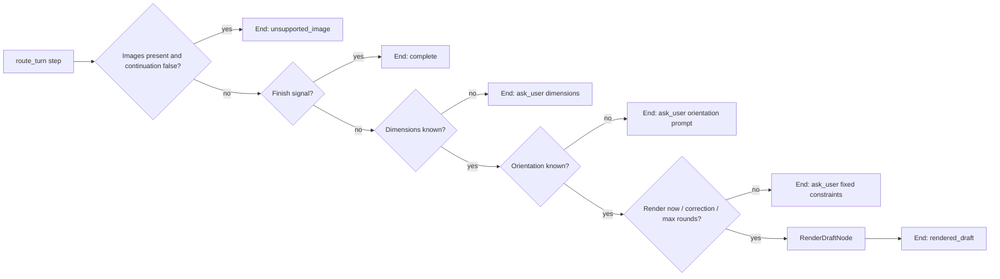

# Floor Plan Intake Subagent

Collect enough room constraints to create an initial floor-plan draft, then iterate with user corrections until the user is satisfied or wants to stop.

## Scope

- In scope:
  - rough dimensions and wall height
  - fixed architecture (doors/windows/unusual shape)
  - fixed/non-movable installed elements
  - iterative render/correction loop
- Out of scope (for now):
  - image parsing (explicitly acknowledged as unsupported)
  - detailed movable furniture placement

## Input contract

`FloorPlanIntakeInput`

- `user_message: str`
- `images: list[str]`
- `thread_id: str | None`
- `allow_continue_without_measurements: bool`

## Output contract

`FloorPlanIntakeOutcome`

- `status: ask_user | rendered_draft | complete | unsupported_image`
- `should_exit: bool`
- `assistant_message: str`
- `scene_revision: int`
- `render_output: FloorPlanRenderOutput | None`
- `collected_summary: dict[str, object]`

## Tools

- Implemented:
  - `tools.render_floor_plan_draft` (wrapper around repository floorplanner tool)
- Stubbed:
  - none

## Decision table

| Condition | Branch | Outcome |
| --- | --- | --- |
| Images provided and continuation not allowed | Unsupported image | Exit with decision prompt |
| User says perfect/close enough/give up | Complete | Exit to parent |
| Missing dimensions | Ask dimensions | Continue intake |
| Missing orientation context | Ask orientation + room-specific constraints | Continue intake |
| User says move on / render / corrections OR round cap reached | Render draft | Return rendered draft |
| Otherwise | Ask fixed constraints | Continue intake |

## Flow (Mermaid)

